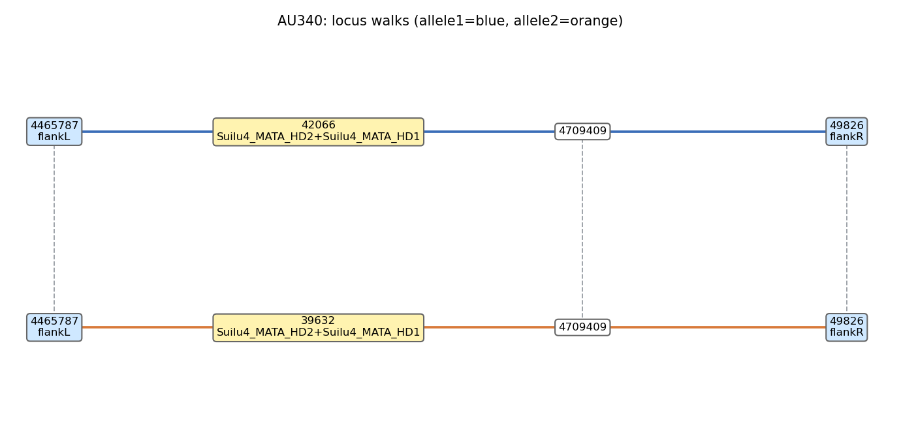

# MATdetangler

Recover the two alleles of a tetrapolar mating-type-like locus from paired-end short reads,
using a **pre-built SPAdes assembly graph** as the substrate. Originally designed for the
fungal HD locus (HD1 / HD2 + conserved flanks); generalizes to any analogous locus with
conserved flanks and one or more variable genes (P/R, PR, idiomorph-like loci).

> Methods + rationale + pseudocode: **[METHODS.md](METHODS.md)**.
> Open algorithmic improvements: **[TODO.md](TODO.md)**.
> Retired methods (legacy `graph_path_search` + `pick_alleles` chain):
> **[METHODS.legacy.md](METHODS.legacy.md)**.

---

## What it actually does

Stages 1–5 are **reads-free** — only the SPAdes assembly + locus reference are needed.
Reads (`--reads-r1`/`--reads-r2`) are required only when you opt into the read-derived
consensus path (stages 6 and 7) via `--make-consensus`.

1. **Input processing → query construction** — tblastn user-supplied HD proteins
   against the locus reference. HSPs are resolved in confidence order with
   cross-protein non-overlap (HD1's weak partial HSPs in HD2's region don't leak
   into HD1's reported span). Per-gene spans come from the union of accepted
   same-protein HSPs; the HD envelope is the union of gene spans padded by 500 bp
   each side. Flanks are auto-derived as the locus sequence outside the envelope
   (trimmed to `--max-flank-len` per side).
2. **Per-K genome coverage** — per-k median of the GFA's per-segment `DP:f:`
   tag across segments ≥ `--contig-depth-size-cut` bp (default 5000). Bp-equivalent
   units; same scale as the segment depths used downstream. Cached as
   `genome_cov_spades_k<K>.txt`. Reads-free, contigs.fasta-free — works on .gfa
   or .gfa.gz transparently.
3. **Per-K allele caller (`matdetangler.run_per_k`)** — for each K:
   extract `S`-line segments from `gfa(K)` → BLAST DB → full outfmt-6 blastn
   flankL/flankR + tblastn HD proteins → labeler builds `seg_label_hits.tsv` →
   `find_alleles` runs the bubble classifier (directional split → bubble BFS →
   universal-leaf anchors → endpoint-flank-status arms → verdict) followed by
   the trim → dedup → emit chain. Writes `<outdir>/<K>/result.tsv` +
   `<outdir>/<K>/alleles.fasta`.
4. **Cross-K consolidation (`matdetangler.pick_k`)** — reads each sample's
   per-K result.tsv files and picks the best K (priority by topology and dedup
   count; tie-break on completeness, locus coverage, diploid balance, total bp,
   raw candidates). Emits `picks.tsv` (legacy 12-col schema, downstream
   compatible) + `picks_summary.tsv` (new sample-level schema with extend_bounds,
   n_dedup, k_chosen) + `primary_alleles.fasta`. Skipped under `--skip-pick`.
5. **Annotated allele walks (`graph_paths`)** — render each picked allele back
   on the GFA: ASCII walk, sub-GFA, DOT, PNG, edge-list TSV. Reads-free.
6. **Mapping + read-derived consensus (`map_consensus.sh`)** — `--make-consensus` opts in.
   Competitive bowtie2 `--end-to-end`, `samtools consensus` per allele, HD-core depth.
7. **Consensus QC (`consensus_qc` + `pairwise_identity` rerun)** — `--make-consensus`
   opts in. tblastn / blastn re-check completeness on the consensus; MAFFT divergence
   re-run on the consensus pair. Keep both pick-level AND consensus-level numbers
   side-by-side in `summary.tsv`.
8. **Cross-sample mating-type clustering (`MATdetangler-cli cluster`)** — separate
   post-batch command. `align` extracts each picked allele's HD-core (variable-gene
   span ±50 bp), runs ONE MAFFT, and emits the pairwise similarity matrix; `cut`
   does single-linkage on the cached matrix at `--thresh` (default 0.90) and writes
   `allele_classification.tsv` + `allele_distance_matrix.tsv`. Cheap to re-run `cut`
   at any threshold.

The legacy contig anchor search (`anchor_search.py` step 2 in earlier versions)
is **no longer in the default flow** — the new per-K caller blasts directly
against GFA segments and doesn't consume anchor seeds.

## Installation

One-time conda environment (covers every external binary the pipeline needs:
SPAdes, BLAST+, bowtie2, samtools, MAFFT, plus Python + matplotlib + edlib):

```bash
conda env create -f install/env.yml      # ~5 min on first run
conda activate matdetangler
```

The pipeline is pure Python stdlib + `matplotlib` (for `bubble.png`) + `edlib`
(for dedup) + a handful of subprocess calls. No biopython, numpy, or other
heavy Python deps. If you already have the external binaries on `$PATH`
(`spades.py`, `makeblastdb`, `tblastn`, `blastn`, `bowtie2`, `samtools`,
`mafft`) plus `pip install edlib`, you can skip the conda env entirely.

## Quick start

```bash
# Step 0 — build per-k SPAdes assemblies (skip if you already have them)
MATdetangler-spades \
  --sample Tu127439 \
  --reads-r1 reads/R1.fq.gz --reads-r2 reads/R2.fq.gz \
  --outdir examples/Tu127439_spades/ \
  --ks 33,45

# Stages 1-5 (reads-free, default) — recover the two alleles
MATdetangler-cli run \
  --sample Tu127439 \
  --spades-dir examples/Tu127439_spades/ \
  --locus-ref examples/Suilu_locus/Suilu4_MATA.fasta \
  --proteins  examples/Suilu_locus/Suilu4_HDs.fasta \
  --outdir results/ \
  --ks k33,k45 \
  --no-skip-pick

# Stages 1-8 with read-derived consensus + QC (opt in)
MATdetangler-cli run \
  --sample Tu127439 \
  --reads-r1 reads/R1.fq.gz  --reads-r2 reads/R2.fq.gz \
  --spades-dir examples/Tu127439_spades/ \
  --locus-ref examples/Suilu_locus/Suilu4_MATA.fasta \
  --proteins  examples/Suilu_locus/Suilu4_HDs.fasta \
  --outdir results/ \
  --ks k33,k45 \
  --no-skip-pick \
  --make-consensus

# Batch (4-col TSV: sample r1 r2 spades_dir; r1/r2 may be "-" when --make-consensus is off)
MATdetangler-cli batch --samplesheet samples.tsv \
  --locus-ref examples/Suilu_locus/Suilu4_MATA.fasta \
  --proteins  examples/Suilu_locus/Suilu4_HDs.fasta \
  --outdir results/ --threads 8 --ks k33,k45 \
  --no-skip-pick

# Only steps 6+7 on a sample already processed (primary_alleles.fasta on disk)
MATdetangler-cli consensus \
  --sample Tu127439 \
  --reads-r1 reads/R1.fq.gz --reads-r2 reads/R2.fq.gz \
  --outdir results/ \
  --locus-ref examples/Suilu_locus/Suilu4_MATA.fasta

# Cross-sample mating-type clustering (step 8): one `align` pass + as many `cut`s as you want
MATdetangler-cli cluster align \
  --results-dir results/ \
  --queries-dir results/Tu127439/queries \
  --out-dir results/clusters/

MATdetangler-cli cluster cut \
  --align-dir results/clusters/ \
  --results-dir results/ \
  --out-dir results/clusters/ \
  --thresh 0.90
```

`MATdetangler-cli cluster align` builds `cores.fasta` (HD-core span ±50 bp per allele),
`cores.aln.fasta` (one MAFFT of all cores), `cores_pairs.tsv` (pairwise HD-core
identities), and `cores_meta.tsv`. `cluster cut` reads the cached pairs/meta —
no re-alignment — and writes `allele_classification.tsv` (columns: allele, sample,
cluster) + `allele_distance_matrix.tsv` (symmetric `1 - sim`). Re-run `cut` with
different `--thresh` values to explore the mating-type partition.

## Inputs

### Required

| flag | what |
|---|---|
| `--locus-ref FASTA` | single-record DNA reference spanning the HD region + both flanks. ~10–15 kb is plenty. |
| `--proteins FASTA` | **curated** protein fasta (HD1, HD2, …). Real proteins, intron-free. Records with duplicate IDs are auto-suffixed (`_1`, `_2`, …). |
| `--sample`, `--spades-dir`, `--outdir` | per-sample inputs |
| `--reads-r1`, `--reads-r2` | **OPTIONAL** — only required when `--make-consensus` is set. The pipeline is reads-free through stage 5 by default. |

### Optional

| flag | default | what |
|---|---|---|
| `--ks LIST` | `k45` | which per-k subdirs of `--spades-dir` to consider. Comma-separated to sweep multiple. |
| `--max-flank-len` | 2000 | trim each flank to at most this many bp |
| `--envelope-padding` | 500 | bp pad on each side of the HD envelope at input processing |
| `--no-skip-pick` | (default = skip ON) | run stage 4 (`pick_k`) — the cross-K picker. Default behavior skips it and aliases the per-K candidate pool as `primary_alleles.fasta`, so stages 5+ run on the raw candidates. `--no-skip-pick` runs the full pipeline. |
| `--make-consensus` | off | Run stage 6 (`map_consensus.sh`) and the consensus-derived parts of stage 7. Default OFF — the pipeline is reads-free through stage 5. `--make-consensus` opts in; `--reads-r1`/`--reads-r2` become required. |
| `--continue` | off | Re-run with additional k's, reusing existing sample-level outputs: stage 1 (`input_process`) is skipped if `queries/manifest.json` exists; per-k genome coverage reuses cached `genome_cov_spades_k<K>.txt`; per-K stage 3 is skipped for any k whose `<outdir>/<K>/result.tsv` already exists. Implies `--no-skip-pick` so `pick_k` runs on the combined per-K pool. |
| `--re-blast` | off | Remove the per-K cache directories (`<outdir>/<sample>/<K>/`) before running. Use whenever you've changed blast parameters or want a clean run. |
| `--threads` | 4 | blast / bowtie2 / mafft thread count |
| `--expected-count {1,2}` | 2 | 1 = haploid, 2 = dikaryon. Consumed by the cross-K picker's diploid-balance tie-break. |
| `--genome-coverage FLOAT` | auto-estimated per k (median of SPAdes contigs.fasta `cov_` across contigs ≥ `--contig-depth-size-cut` bp) | mean genomic depth, bp-equivalent units (same scale as GFA `DP:f:` segment depths). Drives the per-K caller's depth filter band `[lo_mult × D_k, hi_mult × D_k]` AND the diploid-balance tie-break in `pick_k`. When supplied, overrides the per-k estimate for ALL k's. |
| `--contig-depth-size-cut INT` | 5000 | minimum contig length (bp) used by the per-k genome-cov estimator. Lower → more contigs but more short-tip noise. |

The legacy graph_path_search / pick_alleles knobs (`--asymmetric-bfs`,
`--dup-id`, `--dup-frac`, `--max-hops`, `--init-hops`, `--max-walk-bp`,
`--max-locus-len`) no longer apply to the default flow and have been
retired. See `METHODS.legacy.md` if you need to understand what they did.

### Per-K BLAST cache

Heavy BLAST results (per-K segment-level blastn / tblastn) are cached
under each per-K result dir:

```
results/<sample>/<K>/
  flankL_blastn.tsv           ← full outfmt-6, 12 cols
  flankR_blastn.tsv
  HD_tblastn.tsv
  seg_label_hits.tsv          ← labeler output
  result.tsv                  ← 21-col per-K row
  alleles.fasta               ← emitted allele/chimera records
```

To force re-BLAST: delete `<outdir>/<sample>/<K>/` or pass `--re-blast`.

## Preparing the SPAdes graphs (step 0)

MATdetangler needs `contigs.fasta` + `assembly_graph_after_simplification.gfa` for
**each k** in the sweep. The included wrapper `MATdetangler-spades` does this in the
exact layout downstream stages expect:

```bash
# Single sample (submits one SLURM job per k)
MATdetangler-spades \
  --sample Tu127439 \
  --reads-r1 R1.fq.gz --reads-r2 R2.fq.gz \
  --outdir examples/Tu127439_spades/ \
  --ks 33,45,53

# Batch (3-col TSV: sample r1 r2) — submits a SLURM array
MATdetangler-spades batch \
  --samplesheet samples.tsv \
  --outdir examples/Tu127439_spades/ \
  --ks 33,45,53 \
  --threads 8 --mem 24 --time 2:30:00 \
  --account my-acct --partition standard

# Laptop / no SLURM
MATdetangler-spades batch --samplesheet samples.tsv --outdir examples/Tu127439_spades/ --local
```

Defaults:

- `--ks 33,45,53` (override with any comma-separated list, e.g. `21,33,55`)
- `--threads 8`, `--mem 24` (GB), `--time 2:30:00`
- **No BayesHammer** (uses `--only-assembler`), assuming the reads were already
  adapter- and quality-trimmed. Add `--bayes-hammer` if you want SPAdes to do the
  read correction.
- Layout: `<outdir>/<sample>/k<K>/{contigs.fasta, assembly_graph_after_simplification.gfa, contigs.paths}`
- **Skip-safe**: any (sample, k) whose two output files already exist is skipped,
  so re-running the wrapper only fills in the missing tasks.

**Why one SPAdes job per k.** SPAdes' multi-k mode (`-k 33,45,53` in one call)
keeps only the FINAL-k GFA — intermediate k GFAs are stripped. MATdetangler runs
one assembly per (sample, k) pair so each K's GFA is preserved.
`matdetangler/paths.py` resolves either `k33/` (lowercase) or `K33/` (uppercase)
layouts.

## Outputs (per sample, in `results/<sample>/`)



| file | what |
|---|---|
| **`primary_alleles.fasta`** | **The picked allele set** — from the chosen K. Headers `<sample>_<k>_<allele_name>`. Empty if every per-K result errored. By default the `--min-allele-bp` floor is **disabled** (0) — open_bubble samples whose dangling end carries a var node in the tail are EMITTED as a second allele (they represent a real alternative HD-bearing region in the graph: paralog or alternative allele). Set `--min-allele-bp 3000` to restore the legacy filter that hides these sub-HD-content picks when you only want canonical closed-bubble pairs. Each emitted sequence is the "arm-unique" content: the first-non-joint to last-non-joint slice of the BFS-extended fullwalk (cycle-joint nodes shared across arms excluded at the ends), then tblastn locus-trimmed. Joints are detected label-blind via multi-source BFS in the post-P1 graph (a node visited by ≥ 2 arms' BFS frontiers is a joint candidate; pair-search picks the globally-best (j_a, j_b) pair, with per-arm-side fallback for asymmetric open_bubbles where one arm can't reach both joints). Dedup ranking and divergence compare run on the var-trimmed → HD-only slice separately — see METHODS.md §3.8. The cross-K picker ranks completeness FIRST (complete_locus, then complete_var), so the K that emits the most-complete locus wins regardless of the classifier's pre-dedup topology label. **Cov-filter fallback** (default): the per-K caller runs the cov-OFF main pass first; if no complete-locus closed_bubble short-circuits, it falls back to a cov-ON pass over the same nhop range. `--cov-filter off` disables the fallback. **Short-circuit acceptance** requires only `closed_bubble + n≥2 + complete_locus=2` — complete_var is NOT required, so a diploid n=2 with one truncated allele (cv=1) wins over a homozygote-collapsed n=1 (cv=2). **Search-space caps**: `max_paths=1000`, `max_path_length=50`, `max_bp_since_var=5000` (bp-aware path enumeration cap; drops partial paths that wander > 5 kb without hitting a var node), `max_nhop=8` (reduced from 10 — empirically all useful short-circuits on Pcub40 happen by nhop=6). |
| **`longest_alleles.fasta`** | Union of `<K>/longest_alleles.fasta` across all per-K iterations: length-first RC-aware dedup at the same divergence threshold (1%) over the full candidate pool. Each header is prefixed with the source k (e.g. `k45_…`, `k53_…`). Wider net than `primary_alleles.fasta` — useful for downstream variant analyses that want every distinct LONGEST walk we ever observed across the BFS grid. |
| `picks.tsv` | legacy 12-col schema, one row per emitted allele: `sample, allele, origin, k, type, len, from_contig, segments, cov, n_variable_genes, has_both_flanks, is_degHD`. Compatible with downstream `graph_paths` + `summary_table`. |
| `picks_summary.tsv` | sample-level new schema, one row per sample: `sample, k_chosen, bubble_type, n_dedup, complete_var, complete_locus, locus_coverage, basepair, genome_cov, allele_cov, n_cand, extend_bounds, components, all_k_tried`. |
| `<K>/result.tsv` | per-K caller output, 22 columns. See METHODS.md §3.11. `complete_var` and `complete_locus` are now tri-state integers (0=none, 1=some, 2=all). |
| `<K>/alleles.fasta` | per-K picked allele/chimera records (post-dedup, post-`min_allele_bp` floor, HD-only divergence comparison). |
| `<K>/longest_alleles.fasta` | length-first RC-aware dedup over the candidate pool — keeps the LONGEST representative of each edit-distance class (HD-only divergence). |
| `<K>/candidate_allele.fasta` | every emission across all BFS iterations (forensic record). Headers `cand{id}_h{nhop}_n{net}_c{cov}_{verdict}_{name}`. |
| `<K>/subnode_seqs.fasta` | materialized sub-segment sequences for `{parent}#N` IDs (after P1 directional split — one sub-segment per unique-label run on the parent; see METHODS.md §3.3). Consumed by `graph_paths` to draw bubble outputs with coord-free IDs. |
| `<K>/seg_label_hits.tsv` | labeler output for this K. |
| `<K>/{flankL,flankR}_blastn.tsv`, `<K>/HD_tblastn.tsv` | full outfmt-6 BLAST caches. |
| `genome_cov_spades_k<K>.txt` | per-k genome coverage (median of GFA `DP:f:` across segments ≥ 5 kb). Bp-equivalent units. Filename retained for backward compatibility — the value is now GFA-derived, not contigs.fasta-derived. |
| `queries/` | auto-derived `variable_proteins.fasta`, `flankL.fasta`, `flankR.fasta`, `variable_nt.fasta`, `manifest.json`. |
| `consensus_alleles.fasta` | `samtools consensus` per allele. Only written when `--make-consensus`. |
| `reads.sam` | competitive end-to-end bowtie2 mapping reads → picks (`--make-consensus` only). The BAM is built as an internal intermediate for `samtools consensus` and `coverage_core.py`, then deleted — SAM is the human-readable artifact persisted. To re-derive the BAM: `samtools sort -o reads.sorted.bam reads.sam && samtools index reads.sorted.bam`. |
| `coverage.tsv` | per-allele depth: `whole_meandepth` AND `core_meandepth` (HD-core only). `--make-consensus` only. |
| `identity.tsv` | MAFFT id_pct + aln_frac on the picks. |
| `identity_consensus.tsv` | MAFFT id_pct + aln_frac on the read-derived consensus pair. `--make-consensus` only. |
| `consensus_qc.tsv` | tblastn(proteins → consensus) + blastn(flanks → consensus); per-allele `complete` flag. `--make-consensus` only. |
| `bubble.txt` | two-line labeled walks (one per allele) — full joint-to-joint walk including the BFS-detected cycle joints at both endpoints (the "fullwalk"). For open_bubble samples where only one side has a shared joint, the other end falls back to the closest flank-labeled neighbor. Intentionally wider than `primary_alleles.fasta` (which is the non-joint slice + tblastn-trim). |
| `bubble.png` | matplotlib render: each allele on its own row, x-aligned in a unified coordinate system so shared joints across rows sit at the same x. Cross-row solid black lines mark sub-nodes literally shared between rows (the cycle joints). Node face: yellow=var-bearing, blue=flank-only, white=unlabeled. Below each node a normalized coverage tag `×<seg_cov / genome_cov>` is drawn — `×1.0` means haploid depth (single allele), `×2.0` collapsed double allele / repeat. `genome_cov` is auto-read from `<sample>/genome_cov_spades_k<k>.txt` or can be passed via `--genome-cov`. Row direction is canonicalized to match locus-position gene order (from `queries/manifest.json`); single-HD rows use flank-endpoint orientation when var-tag direction is ambiguous. |
| `bubble.gfa` / `.dot` / `.tsv` | sub-GFA + Graphviz + edge list for any network library. |
| `summary.tsv` (per-sample) | one row, same schema as the aggregate's row for this sample. |
| `logs/` | per-step stdout/stderr. |

Plus one aggregate: `results/summary.tsv` (one row per sample). Schema:

```
sample  used_k  bubble_type  genome_coverage
allele1_complete          allele2_complete           ← pick-level (path completeness)
allele1_coverage          allele2_coverage           ← consensus-mapped HD-core depth (--make-consensus)
allele1_vs_allele2_id_pct allele1_vs_allele2_aln_frac ← pick-level divergence
cons_allele1_complete     cons_allele2_complete      ← consensus tblastn re-check (--make-consensus)
cons_allele1_vs_allele2_id_pct cons_allele1_vs_allele2_aln_frac ← consensus divergence
allele1_path  allele2_path
```

## Dependencies

All wrapped by the conda env in `install/env.yml`. External tools (on `$PATH`):

- `spades.py` ≥ 3.15 (only needed for step 0; `MATdetangler-spades`)
- BLAST+ (`makeblastdb`, `blastn`, `tblastn`) ≥ 2.10
- `bowtie2` ≥ 2.4 (and `bowtie2-build`)
- `samtools` ≥ 1.15
- `mafft`

Python ≥ 3.9. The pipeline imports the standard library + `matplotlib` (for
`bubble.png`) + `edlib` (for sequence dedup in the per-K caller). No
biopython / numpy required.

`bash` ≥ 3.2 (the macOS system bash is fine — the wrapper avoids bash-4-only
constructs and empty-array expansion under `set -u`).

## Reproducibility test (`test/Pcub40`)

A frozen 32-sample _P. cubensis_ dataset (`examples/Pcub40/`, GFAs committed as
`*.gfa.gz`) with known-good outputs in `test/Pcub40/known_results.json`. The
harness decompresses each `*.gfa.gz` in place, runs the pipeline, and diffs the
result against the known values (ignoring install-drift fields — MAFFT/BLAST
version noise, coverage estimates).

```bash
conda activate MATdetangler
bash test/Pcub40/run_test.sh                 # all 32 samples
bash test/Pcub40/run_test.sh AJB36 BD-1248   # just these (only the run samples are diffed)
bash test/Pcub40/run_test.sh --slurm         # submit a SLURM array instead of serial
```

Exit 0 = every **run** sample matches; a subset run only checks the samples it
ran. On PASS the decompressed `*.gfa` siblings are kept next to their `*.gfa.gz`
(gitignored) so re-runs reuse them without re-decompressing.

## License & citation

TBD. If you use MATdetangler in a paper, please cite this repository.
