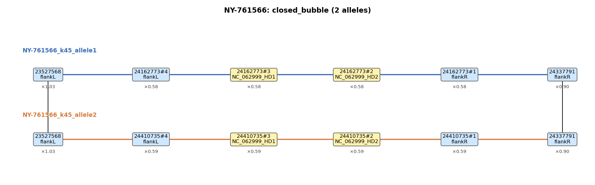

# MATdetangler

Recover the two alleles of a tetrapolar mating-type-like locus from paired-end short reads,
using a **pre-built SPAdes assembly graph** as the substrate. Originally designed for the
fungal HD locus (HD1 / HD2 + conserved flanks); generalizes to any analogous locus with
conserved flanks and one or more variable genes (P/R, PR, idiomorph-like loci).



*Example output for Pcub sample NY-761566 — a clean closed-bubble call.
Two alleles traced through the assembly graph, one row each, x-aligned at
shared joints. Yellow boxes carry variable genes (HD1 / HD2); blue boxes
are pure flanks. The `×N.NN` tag below each segment is the normalized
coverage (`seg_cov / genome_cov`). `genome_cov` is the median GFA segment
depth — for a (mostly homozygous) diploid that's ≈ 2 × haploid coverage,
so a unique bubble-allele segment (one haploid's reads only) reads
**×0.5**, a segment shared between alleles or homozygous background
reads **×1.0**, and a collapsed two-copy repeat reads **×2.0**.*

> Methods + algorithm + pseudocode: **[METHODS.md](METHODS.md)**.
> Open algorithmic improvements: **[TODO.md](TODO.md)**.

---

## What it does (one paragraph)

Pre-built SPAdes per-k assembly graphs come in (GFA `.gfa` or `.gfa.gz`).
For each sample × each k, MATdetangler-cli (a) BLASTs the user-supplied HD
proteins + auto-derived flanks against the segments, (b) finds the bubble
in the graph (set of var-bearing segments + unlabeled connectors between
them), (c) enumerates the simple paths between flank-adjacent anchors,
(d) emits the two divergent allele walks as FASTA + a PNG with normalized
coverage tags. Stages 1–5 are reads-free; stage 6 (`--make-consensus`)
opts in to bowtie2 + `samtools consensus` for a read-derived allele pair.

## Pipeline overview (9 stages)

1. **input_process** — tblastn proteins → locus_ref → confidence-ordered HSP acceptance → derive HD envelope and per-side flanks → write `queries/{variable_proteins, variable_nt, flankL, flankR, manifest.json}`.
2. **Per-K genome coverage** — median of GFA per-segment `DP:f:` across segments ≥ 5 kb → `genome_cov_spades_k<K>.txt`. Reads-free, **GFA-only** (no contigs.fasta).
3. **Per-K allele caller** (`matdetangler.run_per_k` → `find_alleles`) — per k: BLAST DB the GFA segments, blastn flanks + tblastn proteins, build `seg_label_hits.tsv`, P1 directional split into pure-role sub-nodes, bubble BFS, R1–R4 classification (closed_bubble / open_bubble / single / complexed / separate), arm enumeration with three caps (`max_paths=1000`, `max_path_length=50`, `max_bp_since_var=5000`), 4-tier ranking, dedup. **Two-pass cov-filter loop**: cov-OFF main + cov-ON fallback (only if the main pass didn't accept).
4. **Cross-K consolidation** (`pick_k`) — pick the best k by `(complete_locus, complete_var, bubble_priority, diploid_dist)`. Skipped under `--skip-pick` (default).
5. **Annotated bubble views** (`graph_paths`) — bubble.{txt,gfa,dot,tsv,png}. PNG carries `×N.NN` normalized coverage per segment.
6. **Read mapping + consensus** (`map_consensus.sh`, `--make-consensus` only) — bowtie2 competitive end-to-end → `samtools consensus`. Persists `reads.sam` (BAM is internal intermediate); `consensus_alleles.fasta` keeps original reference seq IDs.
7. **Identity + QC** — MAFFT pairwise identity on the picks + (if consensus) on the consensus pair; tblastn / blastn re-check of consensus completeness.
8. **summary_table** — wide-format per-sample `summary.tsv` row (verdict, completeness, identities, allele paths).
9. **summarize.py** — comprehensive cross-run-comparable `summary.json` (NEW step; the dictionary form of summary.tsv plus the BFS per-k trace and finished_nhop; used by `test/Pcub40/*_run_test.sh`).

**Determinism**: the wrapper exports `PYTHONHASHSEED=0` so set/dict iteration order is locked. Two independent runs of the same demo on the same install are byte-identical (including the exact graph segments per allele).

## Installation

```bash
# One-time conda environment — SPAdes, BLAST+, bowtie2, samtools, MAFFT,
# Python (3.9+), matplotlib, edlib, git-lfs.
conda env create -f install/env.yml      # ~5 min on first run
conda activate MATdetangler
```

If you already have the external binaries on `$PATH` (`spades.py`,
`makeblastdb`, `tblastn`, `blastn`, `bowtie2`, `samtools`, `mafft`,
`git-lfs`) plus `pip install edlib`, you can skip the conda env entirely.

### Verify the install

```bash
# Pull the LFS-stored demo GFAs (1.9 GB; first time only)
git lfs install
git lfs pull

# Run the test (32 samples, ~3 min wall on SLURM, ~20-30 min serial)
bash test/Pcub40/installation_run_test.sh                 # serial
bash test/Pcub40/installation_run_test.sh --slurm         # SLURM array
bash test/Pcub40/installation_run_test.sh AJB36 BD-1248   # subset
```

PASS = your install reproduces `test/Pcub40/known_results.json` (the
committed Pcub40 baseline) on every sample run. The widened tolerance
ignores documented install-drift fields (MAFFT alignment scores,
human-readable path strings, allele lengths, per-allele cov); the
analysis-critical fields (bubble_type, complete_var, complete_locus,
n_dedup, allele identity, segments) are compared strictly.

The companion script `test/Pcub40/analysis_run_test.sh` does the OPPOSITE:
when you've changed the implementation and want a structured report of
which Pcub40 samples got called differently. It ALWAYS exits 0 —
divergence is information, not error. Reports per-sample by change
category (verdict / completeness / allele-structure / BFS-state /
segment-drift).

## Quick start

```bash
# Step 0 — build per-k SPAdes assemblies (skip if you already have them)
MATdetangler-spades \
  --sample Tu127439 \
  --reads-r1 reads/R1.fq.gz --reads-r2 reads/R2.fq.gz \
  --outdir examples/Tu127439_spades/ \
  --ks 45,53

# Stages 1-5 (reads-free, default) — recover the two alleles
MATdetangler-cli run \
  --sample Tu127439 \
  --spades-dir examples/Tu127439_spades/ \
  --locus-ref examples/Suilu_locus/Suilu4_MATA.fasta \
  --proteins  examples/Suilu_locus/Suilu4_HDs.fasta \
  --outdir results/ \
  --ks k45,k53 \
  --no-skip-pick

# Stages 1-8 with read-derived consensus + QC (opt in)
MATdetangler-cli run \
  --sample Tu127439 \
  --reads-r1 reads/R1.fq.gz  --reads-r2 reads/R2.fq.gz \
  --spades-dir examples/Tu127439_spades/ \
  --locus-ref examples/Suilu_locus/Suilu4_MATA.fasta \
  --proteins  examples/Suilu_locus/Suilu4_HDs.fasta \
  --outdir results/ \
  --ks k45,k53 \
  --no-skip-pick \
  --make-consensus

# Batch (4-col TSV: sample r1 r2 spades_dir; r1/r2 may be "-" when --make-consensus is off)
MATdetangler-cli batch --samplesheet samples.tsv \
  --locus-ref examples/Suilu_locus/Suilu4_MATA.fasta \
  --proteins  examples/Suilu_locus/Suilu4_HDs.fasta \
  --outdir results/ --threads 8 --ks k45,k53 \
  --no-skip-pick

# Only steps 6+7 on a sample already processed (primary_alleles.fasta on disk)
MATdetangler-cli consensus \
  --sample Tu127439 \
  --reads-r1 reads/R1.fq.gz --reads-r2 reads/R2.fq.gz \
  --outdir results/ \
  --locus-ref examples/Suilu_locus/Suilu4_MATA.fasta

# Cross-sample mating-type clustering (step 8): one `align` pass + as many `cut`s as you want
MATdetangler-cli cluster align \
  --results-dir results/ \
  --queries-dir results/Tu127439/queries \
  --out-dir results/clusters/

MATdetangler-cli cluster cut \
  --align-dir results/clusters/ \
  --results-dir results/ \
  --out-dir results/clusters/ \
  --thresh 0.90
```

`MATdetangler-cli cluster align` builds `cores.fasta` (HD-core span ±50 bp per allele),
`cores.aln.fasta` (one MAFFT of all cores), `cores_pairs.tsv` (pairwise HD-core
identities), and `cores_meta.tsv`. `cluster cut` reads the cached pairs/meta —
no re-alignment — and writes `allele_classification.tsv` (columns: allele, sample,
cluster) + `allele_distance_matrix.tsv` (symmetric `1 - sim`). Re-run `cut` with
different `--thresh` values to explore the mating-type partition.

## Inputs

### Required

| flag | what |
|---|---|
| `--locus-ref FASTA` | single-record DNA reference spanning the HD region + both flanks (~10–15 kb is plenty). |
| `--proteins FASTA` | curated protein fasta (HD1, HD2, …). Real proteins, intron-free. Duplicate IDs auto-suffixed (`_1`, `_2`, …). |
| `--sample`, `--spades-dir`, `--outdir` | per-sample inputs. spades-dir contains `k<K>/assembly_graph_after_simplification.gfa[.gz]`. |
| `--reads-r1`, `--reads-r2` | **OPTIONAL** — only required when `--make-consensus` is set. Pipeline is reads-free through stage 5 by default. |

### Optional (most-used)

| flag | default | what |
|---|---|---|
| `--genome-coverage FLOAT` | auto-estimated from GFA `DP:f:` median | mean genomic depth, bp-equivalent. When supplied, overrides per-k estimate for ALL k's. |
| `--ks LIST` | `k45,k53` | k subdirs to consider |
| `--threads N` | 4 | threads for blast/bowtie2/mafft |
| `--expected-count {1,2}` | 2 | 1=haploid, 2=dikaryon |
| `--no-skip-pick` | (skip is default) | run step 4 (pick_k) + step 8 (summary row) instead of QC-only |
| `--make-consensus` | OFF | opt in to step 6 (read mapping + consensus). Requires `--reads-r1`/`-r2`. |
| `--cov-filter {on,off}` | `on` | depth filter on BFS neighborhood. `on` = cov-OFF main + cov-ON fallback; `off` = cov-OFF only, no fallback. |
| `--max-nhop N` | 8 | BFS hop count cap. Reduced from 10 in 2026-06 (Pcub40 sweeps show 53/53 useful short-circuits by nhop=6). |
| `--init-nhop N` | 3 | initial BFS hop count |
| `--max-paths N` | 1000 | cap on simple paths per anchor in classifier |
| `--max-path-length N` | 50 | cap on per-path length (# post-P1 nodes) |
| `--max-bp-since-var N` | 5000 | bp-aware path enumeration cap; drop partial paths whose bp since last var-bearing node exceeds this. 0 disables. |
| `--seeds {var,flank,both}` | `both` | BFS seed source |
| `--lo-mult X --hi-mult Y` | 0.2 / 2.0 | cov filter band `[X × D_k, Y × D_k]` |
| `--min-allele-bp N` | 0 | hard min-bp floor on dedup pool. 0 = disabled. |
| `--contig-depth-size-cut N` | 5000 | min seg length (bp) used by the GFA-DP median estimator |
| `--debug` | OFF | trace every shell command + unbuffered Python |
| `--re-blast` | OFF | wipe per-sample cached blast result TSVs before running |
| `--continue` | OFF | reuse cached per-k outputs; useful when adding a new k to an existing sample |

Full per-K caller pass-through: `--divergence-threshold`, `--locus-padding`, `--asymmetric-bfs` — see `MATdetangler-cli` `--help`.

## Outputs (per sample, in `results/<sample>/`)

| file | what |
|---|---|
| **`primary_alleles.fasta`** | **The picked allele set** — from the chosen K. Headers `<sample>_<k>_<allele_name>`. Each emitted sequence is the "arm-unique" content: the first-non-joint to last-non-joint slice of the BFS-extended fullwalk (cycle-joint nodes shared across arms excluded at the ends), then tblastn locus-trimmed. Joints are detected label-blind via multi-source BFS in the post-P1 graph. Dedup ranking and divergence compare run on the var-trimmed → HD-only slice separately — see METHODS.md §3e. The cross-K picker ranks completeness FIRST (complete_locus, then complete_var). **Cov-filter fallback** (default): the per-K caller runs the cov-OFF main pass first; if no complete-locus closed_bubble short-circuits, it falls back to a cov-ON pass over the same nhop range. **Short-circuit acceptance** requires only `closed_bubble + n≥2 + complete_locus=2` — complete_var is NOT required, so a diploid n=2 with one truncated allele (cv=1) wins over a homozygote-collapsed n=1 (cv=2). **Search-space caps**: `max_paths=1000`, `max_path_length=50`, `max_bp_since_var=5000`, `max_nhop=8`. |
| `longest_alleles.fasta` | length-first RC-aware dedup over the candidate pool — keeps the LONGEST representative of each edit-distance class (HD-only divergence). |
| `picks.tsv` | per-allele 12-col metadata: sample, allele, origin, k, type, len, from_contig, segments, cov, n_variable_genes, has_both_flanks, is_degHD. |
| `picks_summary.tsv` | sample-level (`--no-skip-pick` only): k_chosen, bubble_type, n_dedup, complete_var, complete_locus, locus_coverage, basepair, genome_cov, allele_cov, n_cand, extend_bounds, components, all_k_tried. |
| `summary.tsv` | wide-format pairwise summary (sample, used_k, bubble_type, genome_coverage, allele*_complete, allele*_coverage, allele1_vs_allele2_id_pct/aln_frac, cons_*, allele*_path). |
| `summary.json` | NEW (step 9) — same data as summary.tsv plus per-allele segments + per-k BFS trace + finished_nhop + git hash + args. Cross-run-comparable. |
| `bubble.{txt,gfa,dot,tsv}` | bubble views (ASCII / Bandage-loadable sub-GFA / Graphviz / edge list TSV). |
| `bubble.png` | matplotlib render: each allele on its own row, x-aligned at shared joints. Cross-row solid black lines mark sub-nodes literally shared between rows. Node face: yellow=var-bearing, blue=flank-only, white=unlabeled. Below each node a normalized coverage tag `×<seg_cov / genome_cov>` is drawn. `genome_cov` is the median GFA segment depth (≈ 2× haploid in a low-het diploid), so `×0.5` ≈ unique bubble-allele segment, `×1.0` ≈ shared-between-alleles or homozygous background, `×2.0` ≈ collapsed two-copy repeat. |
| `genome_cov_spades_k<K>.txt` | per-k genome coverage (median DP:f: across GFA segments ≥ 5 kb). Bp-equivalent units. Cached for `--continue`. |
| `queries/` | auto-derived `variable_proteins.fasta`, `flankL.fasta`, `flankR.fasta`, `variable_nt.fasta`, `manifest.json`. |
| `consensus_alleles.fasta` | `samtools consensus` per allele. **Record IDs preserved verbatim** from the input reference (drop-in replacement, no rename to `allele_1/2/3`). `--make-consensus` only. |
| `reads.sam` | competitive end-to-end bowtie2 mapping reads → picks (`--make-consensus` only). The BAM is built as an internal intermediate for `samtools consensus` + `coverage_core.py`, then deleted — SAM is the human-readable artifact persisted. Re-derive BAM via `samtools sort -o reads.sorted.bam reads.sam && samtools index reads.sorted.bam`. |
| `coverage.tsv` | per-allele depth: whole_meandepth AND core_meandepth (HD-core only). `--make-consensus` only. |
| `identity.tsv` | MAFFT identity + alignment-fraction on the picks. |
| `identity_consensus.tsv` | same, on the consensus (when produced). |
| `consensus_qc.tsv` | tblastn / blastn re-check of consensus completeness. |
| `_graph.json` | per-allele segment walks (machine-readable). |
| `<K>/result.tsv` | per-K caller output, 22 columns. `complete_var` and `complete_locus` are tri-state integers (0=none, 1=some, 2=all). |
| `<K>/alleles.fasta` | per-K picked allele/chimera records (post-dedup, post-`min_allele_bp` floor, HD-only divergence comparison). |
| `<K>/candidate_allele.fasta` | every emission across all BFS iterations (forensic record). Headers `cand{id}_h{nhop}_n{net}_c{cov}_{verdict}_{name}`. |
| `<K>/seg_label_hits.tsv` | labeler output for this K. |
| `<K>/{flankL,flankR}_blastn.tsv`, `<K>/HD_tblastn.tsv` | full outfmt-6 BLAST caches. |
| `logs/` | per-step stdout/stderr. The per-K caller log (`logs/03_run_per_k_k<K>.log`) carries the BFS trace consumed by `summary.json`. |

### Per-K BLAST cache

Cached at `<outdir>/<sample>/<K>/{flankL,flankR}_blastn.tsv` + `HD_tblastn.tsv`. First run blasts; downstream stages re-read them. Pass `--re-blast` to wipe and recompute (after changing blast thresholds).

## Preparing the SPAdes graphs (step 0)

The pipeline assumes you already have per-k SPAdes runs. If not, the
`MATdetangler-spades` helper wraps the per-k SPAdes call:

```bash
# Single sample (submits one SLURM job per k)
MATdetangler-spades \
  --sample Tu127439 \
  --reads-r1 reads/R1.fq.gz --reads-r2 reads/R2.fq.gz \
  --outdir examples/Tu127439_spades/ \
  --ks 45,53

# Batch (3-col TSV: sample r1 r2) — submits a SLURM array
MATdetangler-spades-batch --samplesheet samples.tsv --outdir spades_out/ --ks 45,53
```

Each k gets its own `spades.py` invocation (single-k mode), which is the
only way to retain the per-k GFA. (SPAdes' multi-k mode `-k 21,33,55`
keeps only the final-k GFA.) The output dir layout is what
`MATdetangler-cli run --spades-dir` expects.

## Dependencies

The pipeline is pure Python stdlib + `matplotlib` (for `bubble.png`) + `edlib`
(for dedup) + a handful of subprocess calls (BLAST+, MAFFT, bowtie2, samtools).
No biopython, numpy, or other heavy Python deps. Python ≥ 3.9 (needs
`from __future__ import annotations` support — every module starts with that
line). The conda env in `install/env.yml` provides all the external binaries
plus `git-lfs` (required to fetch the demo GFAs under `examples/Pcub40/`).

## Determinism + reproducibility

- `MATdetangler-cli` exports `PYTHONHASHSEED=0` at startup. Locks Python set/dict iteration order; bit-for-bit reproducible across runs on the same install.
- `test/Pcub40/` is the canonical regression suite:
  - `installation_run_test.sh` — strict tolerance, exits 1 on any divergence
  - `analysis_run_test.sh` — biology-focused, always exits 0, structured per-sample report
  - `known_results.json` — 32-sample committed baseline
  - `run_args.json` — canonical run configuration document
- The decompressed `.gfa` siblings (under `examples/Pcub40/<sample>/k<k>/`) are gitignored; the canonical `.gfa.gz` is stored via git-lfs.

## Layout

```
MATdetangler-cli           # the wrapper (case-renamed from `MATdetangler` for case-insensitive filesystem safety)
MATdetangler-spades        # per-k SPAdes orchestrator
matdetangler/              # package
  graph_classifier/
    bubble_classifier.py   # R1–R4 + _enum_paths / _enum_dangling
    bubble_bfs.py          # P2 bubble-from-var BFS
    seg_processor.py       # P1 directional split
    per_k_caller.py        # find_alleles orchestrator (two-pass loop, dedup, emit)
    labeler.py             # seg_label_hits.tsv producer
  input_process.py         # tblastn → flanks → queries
  run_per_k.py             # per-k BLAST + classify CLI
  pick_k.py                # cross-K consolidation
  graph_paths.py           # bubble.{txt,gfa,dot,tsv,png} renderer
  map_consensus.sh         # bowtie2 + samtools consensus
  pairwise_identity.py     # MAFFT pairwise id
  consensus_qc.py          # tblastn / blastn re-check of consensus
  coverage_core.py         # per-allele HD-core depth
  cluster.py               # cross-sample mating-type clustering
  summary_table.py         # summary.tsv writer
  summarize.py             # NEW: comprehensive summary.json (step 9)
examples/
  Pcub_locus/              # locus ref + HD proteins (Pcub demo)
  Pcub40/<sample>/k<k>/    # 96 LFS-stored .gfa.gz (32 samples × 3 ks)
  Suilu_locus/, AU340/, …
test/Pcub40/
  installation_run_test.sh # strict reproducibility test
  analysis_run_test.sh     # biology-focused report (no pass/fail)
  known_results.json       # committed baseline
  run_args.json            # canonical args document
results/Pcub40/
  primary_allele/          # 32 picked-allele FASTAs
  bubble_png/              # 32 cov-annotated bubble PNGs
  per_sample/              # full pipeline output per sample (18 MB total)
install/env.yml            # conda environment specification
```

## Help + feedback

- `/help` in the CLI for option reference: `MATdetangler-cli` (no args) or `MATdetangler-cli run --help`.
- Methods deep dive: **[METHODS.md](METHODS.md)**.
- Open algorithmic improvements: **[TODO.md](TODO.md)**.
- Issues: https://github.com/KeFungi/MATdetangler-demo/issues
